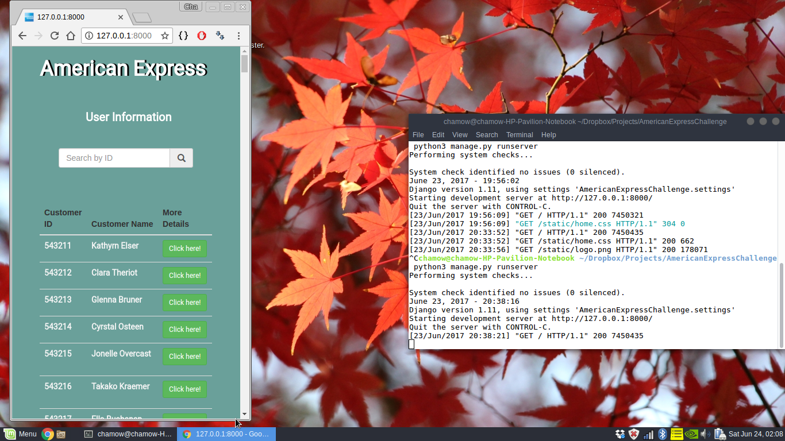
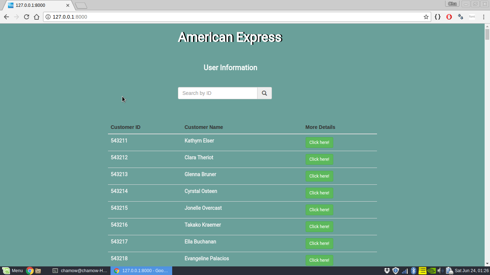
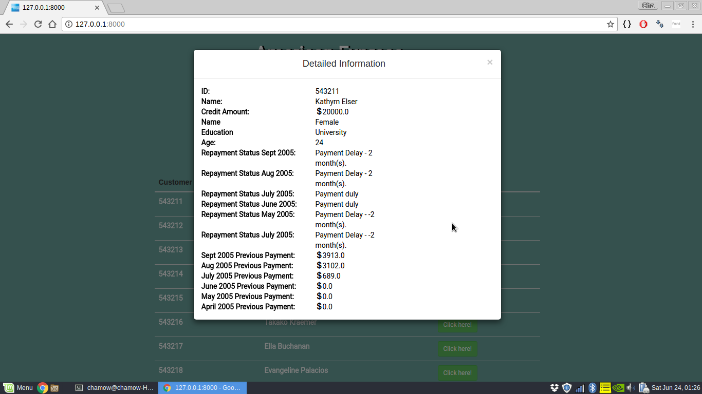
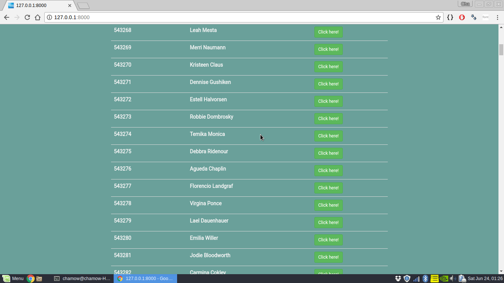
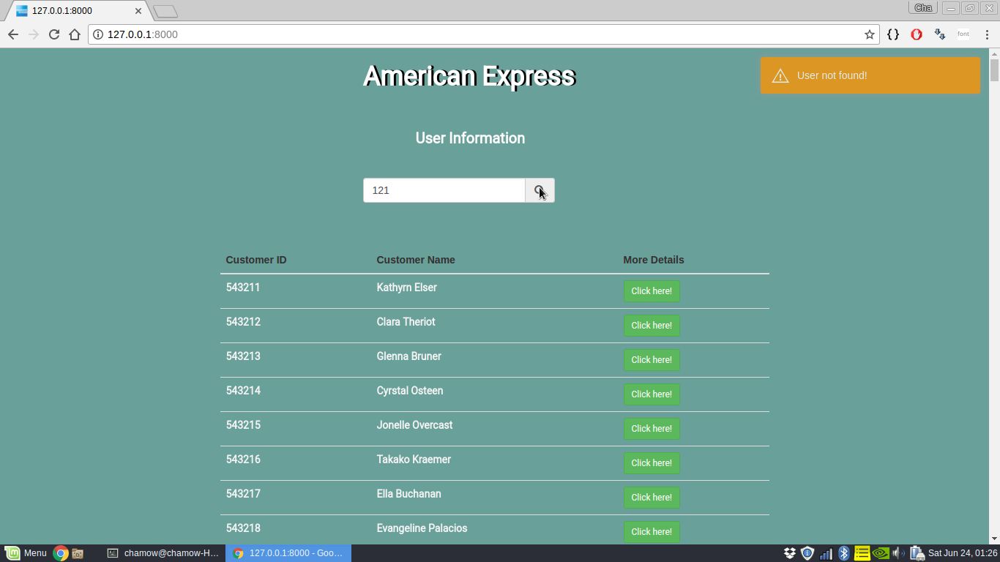
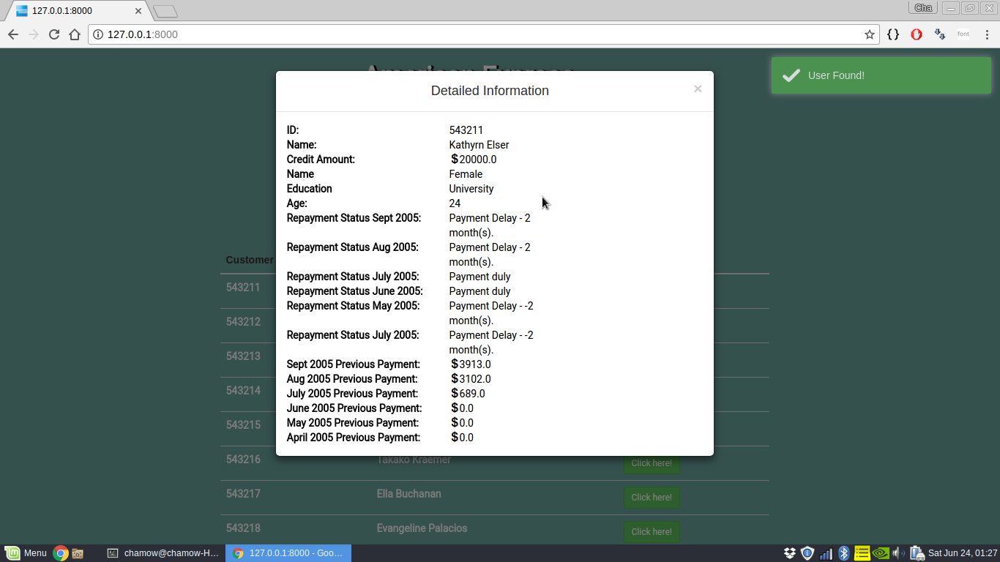

<!DOCTYPE html>
<html>
<body>
	<h1 style="margin-left: auto; margin-right: auto; text-align: center;"><strong>American Express Challenge</strong></h1>
	   
	<h3><strong>Overview: </strong></h3>
	
This Web App displays credit card statements for the past six months.

	 
	<h3><strong>Technologies Used: </strong></h3>
	<h4>Front-end: HTML, CSS, JS</h4>
	<h4>Back-end: Django(Python web framework)</h4>
	<h4>Libraries/Frameworks: JQuery, Bootstrap, Toastr(to give toast notifications)</h4>
	 
	<h3><strong>How to run the web app? </strong></h3>
	<ul>
		<li>Windows Users: 
			<ol>
			 
				<li>Install python 3 which can be downloaded from <a href="https://www.python.org/downloads/">here.</a></li>
				<li>Install Django from Windows Power Shell by typing: <code> pip install django</code></li>
				<li>Navigate your powershell to the project source folder.Type this command which migrates the database: <code>python manage.py migrate</code> </li>
				<li>Now type this command to run the web app: <code>python manage.py runserver</code></li>
				<li>Open a browser and type "localhost" in the address bar to view the web app.</li> 
			</ol>
		</li>
		<li>Linux/Mac Users:  
			<ol> 
				<li>Open terminalInstall python 3 using this command: <code>sudo apt-get install python3</code></li>
				<li>Install python 3 using this command: <code>sudo apt-get install python3</code></li>
				<li>Install django using this command: <code>sudo pip install django</code></li>
				<li>Navigate to the project source location.</li>
				<li>Now type this command to run the web app: <code>python manage.py runserver</code></li>
				<li>Open a browser and type "localhost" in the address bar to view the web app.</li>
			</ol>
		</li>
	</ul>
	 
<h3>Features:</h3>
<ol> 
	<li>Includes a python script which converts CSV to Django models.(Located in the source folder with name "converter.py")</li> 
	<li>Mobile and Desktop Friendly.    </li> 
	<li>Cleaner representation using Bootstrap Modal.  </li>  
	<li>Table view for an overview of data.     </li>
	<li>Search by ID which gives detailed information if present and gives a notification if not present.      </li>

</ol>
  

<strong>Thank you for giving me this wonderful opportunity. Any queries? Drop a mail here: chamow97@hotmail.com </strong>

You can also check out my readme.txt file.

</body>
</html># American-Express-Challenge